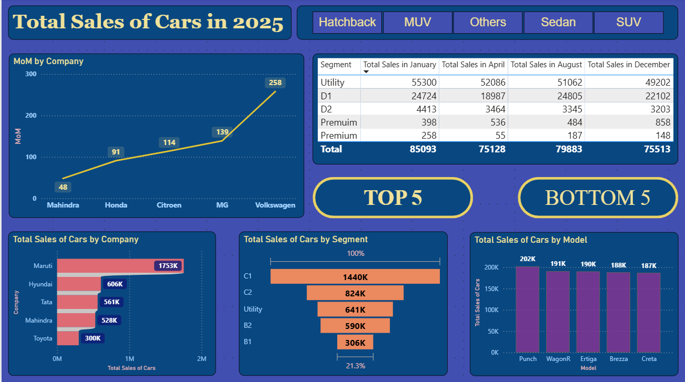

**Car Sales Data Analysis (Power BI, Power Query)**

Power BI dashboard analyzing car sales performance across regions and categories with Top 5 / Bottom 5 dynamic filtering

A) Overview
Analyzed raw car sales data to track performance across regions, 
categories, and time periods using Power BI and Power Query.

B) Key Features
- Top 5 / Bottom 5 dynamic filtering for product performance
- Regional and category-level sales breakdown
- Revenue trend visualization for high-growth segment identification

C) Technical Implementation
- Cleaned and transformed raw data using Power Query
- Handled missing values and inconsistencies for analysis-ready datasets
- Built structured dashboard to track sales KPIs across regions and categories
- Implemented dynamic filtering to instantly identify best and worst performers

D) Tools Used
Power BI, Power Query

E) Files
- Screenshots/ — Dashboard images

1. Top 5
   
   
