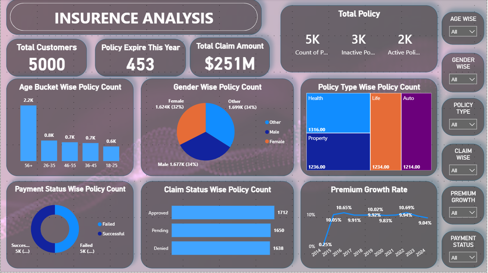
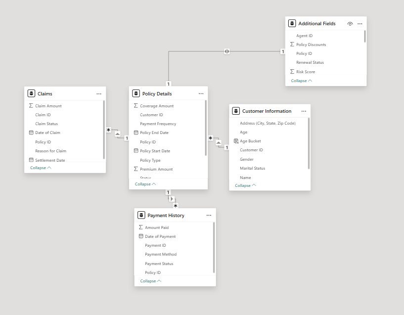
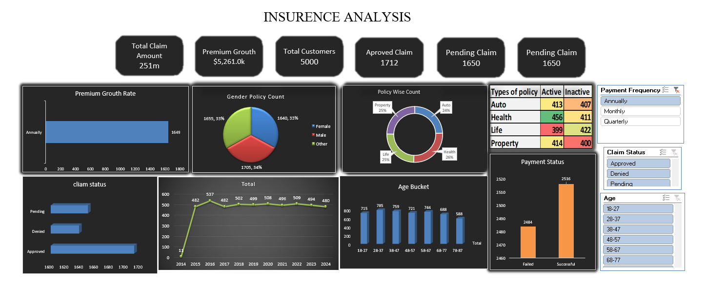
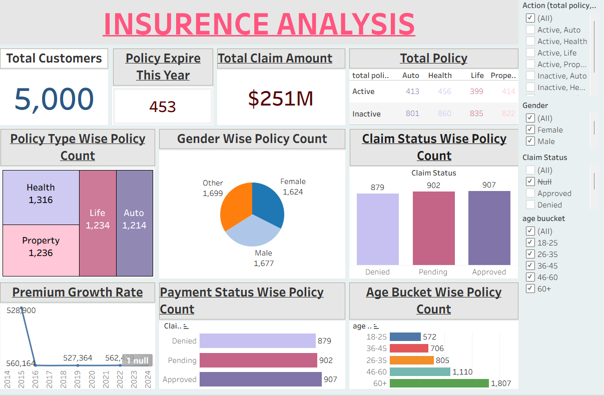

1) Insurance Policy Analysis Dashboard

End-to-end insurance analytics project built across Power BI, SQL, Excel and Tableau — analyzing 20,000+ records across 4 relational tables

2) Overview
Analyzed 20,000+ insurance records across 4 relational tables 
(Policy Details, Claims, Payment History, Customer Information) 
covering 5,000 customers and $251M in total claim value.

3) Business KPIs Tracked (10 Total)
1. Total Policy Count
2. Total Customers
3. Age Bucket Wise Policy Count
4. Gender Wise Policy Count
5. Policy Type Wise Policy Count
6. Policies Expiring This Year (453)
7. Premium Growth Rate (YoY)
8. Claim Status Wise Policy Count
9. Payment Status Wise Policy Count
10. Total Claim Amount ($251M)

4) Key Insights
- 453 policies expiring this year — renewal opportunity
- Claim approval rate nearly equal across Approved/Pending/Denied
- 60+ age group holds highest policy count (1,807)
- UPI and Cash dominate payment methods

5) Technical Implementation
- Built star-schema data model in Power BI connecting 4 tables on Policy ID and Customer ID
- Wrote 10 SQL queries using JOINs, CASE statements, CTEs, and LAG window functions
- Calculated year-over-year Premium Growth Rate using CTE + LAG window function
- Used YEAR(CURDATE()) for dynamic policy expiry detection
- Replicated full analysis in Excel (pivot tables, Power Query, KPI cards) and Tableau

6) Tools Used
Power BI, DAX, MySQL, Advanced Excel, Power Query, Tableau

7) Files
- SQL_Queries.sql — All 10 queries used for KPI calculation
- Screenshots/ — Power BI and Excel dashboard images

8) Dashboards

- Power BI

- Excel

- Tableau

